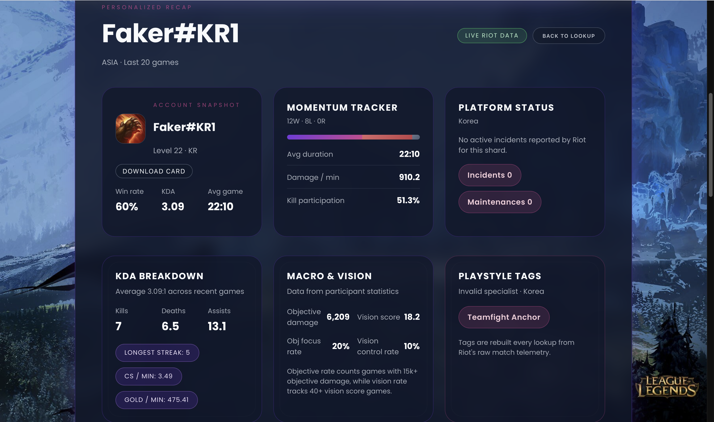

# LoL Recap

**LoL Recap** is a web application that generates personalized League of Legends match and season recaps for players. Leveraging AWS Bedrock for AI-powered text generation, the app provides insightful summaries of gameplay performance in natural language.  

---

## Table of Contents

- [Features](#features)  
- [Screenshots](#screenshots)  
- [Tech Stack](#tech-stack)  
---

## Features

- Generate detailed recaps of League of Legends matches or seasonal performance.  
- AI-powered natural language summaries using **AWS Bedrock** foundation models.  
- User-friendly form interface with **React + Amplify**.  
- Secure API calls using **AWS Lambda** and **IAM authorizers**.  
- Dynamic views: form input, recap display, and error handling.  

---

## Screenshots

  
  
  

---

## Tech Stack

- **Frontend:** React, AWS Amplify  
- **Backend:** AWS Lambda, API Gateway  
- **AI:** AWS Bedrock (Anthropic Claude, Meta models)  
- **Hosting/CI:** AWS Amplify Hosting  
- **Auth & Permissions:** AWS IAM  

---
